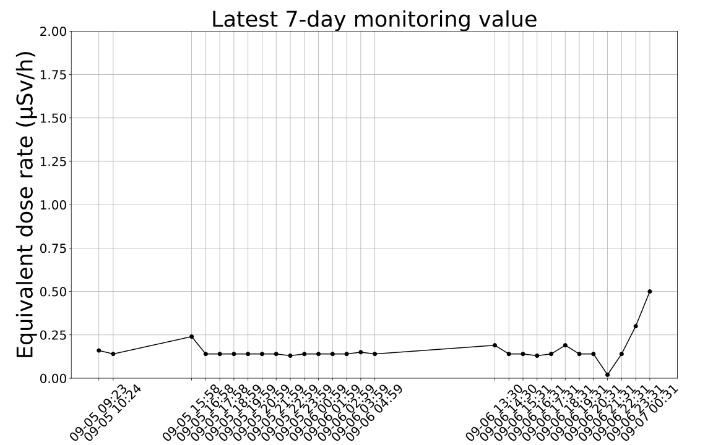

# Radiation_Monitoring_Station
### 最近7天监测数据

本监测站的监测数据是通过仪器监测直接获取所得，可能由于停电，断网等现象导致监测异常，所以本监测站的数据仅作为参考，最终数据以官方正式报告为准。

### 技术原理

本监测站使用的是开源盖格计数器方案，使用嘉立创PCB服务，使用一块老的电视机顶盒作为Linux服务器推送串口数据，并没有采用ESP8266方案作为物联网开发（需要购买第三方物联网平台开发故放弃），使用[Azure Cosmos DB](https://learn.microsoft.com/en-us/azure/cosmos-db/mongodb/introduction)作为数据库存储，通过Github Actions计划任务读取数据和绘制图表，并部署到静态网站进行公开访问。监测站每6小时推送一次数据到数据库，推送的数据为6小时间隔的平均数。

服务端代码已开源，PCB近期整理开源

### 注意事项

此监测站设立在浙江舟山最东边的岛屿-东极岛,(预计9月中旬上岛安装，目前还在测试）可以第一时间监测来自福岛核电站排放的核废水对海洋的污染，监测数据是通过仪器监测直接获取所得，可能由于停电，断网等现象导致监测异常，所以本监测站的数据仅作为参考，最终数据以官方正式报告为准。

此监测站只为个人研究目的，且未进行专业仪器校准，发布的数据为辐射自动监测站的实时监测数据，未经审核，请以官方发布为准，且进行电离辐射监测可能需要获得相关许可或批准。本数据为未扣除仪器对宇宙射线响应部分的环境地表γ辐射剂量率。 环境中γ辐射水平的评价请参考全国空气吸收剂量率发布系统https://data.rmtc.org.cn/gis/listtype0M.html

### 法律法规

[中华人民共和国国家生态环境标准 近岸海域生态环境监测技术规范 辐射环境监测技术规范](https://www.mee.gov.cn/ywgz/fgbz/bz/bzwb/hxxhj/xgjcffbz/202104/W020210430549990358487.pdf)

联系方式：Email：[i@ruiprime.cn](mailto:i@ruiprime.cn)
